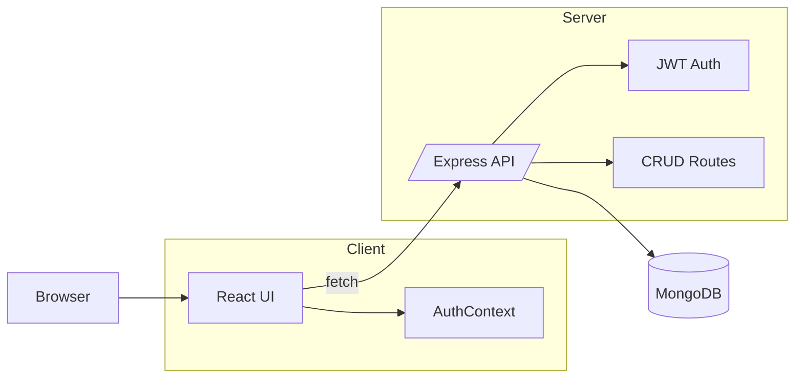
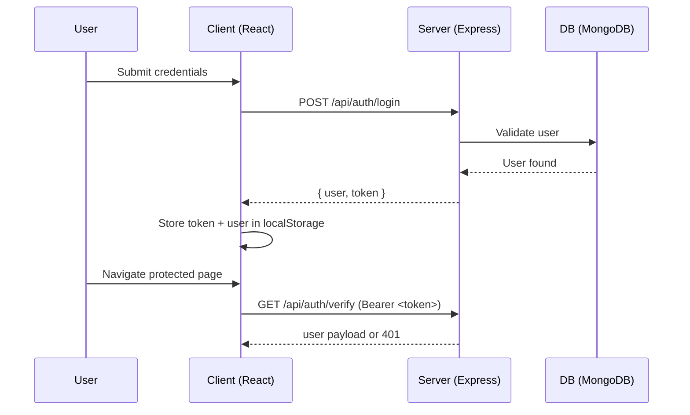

# 🎉 Eventinity — Event Discovery & Registration Platform

Eventinity is a full-stack web app to discover, search, and register for events. It ships with authentication, admin tooling, responsive UI, and an API-backed data model. This repo contains both the React client and the Express server.

## 🔑 Demo Credentials
- Admin: `admin@eventinity.com` / `admin123`
- Demo User: `user@eventinity.com` / `user123`

> These exist in the seed data and demo fallbacks.

## ✨ Features

### User Features
- 🔐 **Authentication System** - Secure login/signup with JWT tokens
- 📅 **Event Discovery** - Browse upcoming events with beautiful card layouts
- 🎫 **Event Registration** - Register for events with form validation
- 👤 **User Dashboard** - View registered events and manage profile
- 📱 **Responsive Design** - Works seamlessly on all devices
- 🎨 **Modern UI** - Beautiful glassmorphism design with smooth animations

### Admin Features
- 🛠️ **Admin Dashboard** - Comprehensive event management interface
- ➕ **Event Creation** - Add new events with rich details
- 📊 **Registration Tracking** - Monitor event attendance and capacity
- 👥 **User Management** - View and manage user registrations

### Technical Features
- ⚡ **Real-time Updates** - Live registration counts and availability
- 🎭 **Smooth Animations** - Engaging UI transitions and micro-interactions
- 🔄 **Automatic Linking** - Past registrations automatically linked to user accounts
- 🛡️ **Data Validation** - Comprehensive form validation and error handling
- 📊 **Progress Tracking** - Visual attendance indicators

## 🏗️ Project Structure

```
event-registration/
├── client/                 # React + Vite frontend
│   ├── src/
│   │   ├── components/     # Reusable UI components
│   │   ├── contexts/       # Auth/Theme providers
│   │   ├── pages/          # Home, Login, Signup, Profile, Admin
│   │   ├── utils/          # Avatar utils + tests
│   │   ├── api.ts          # API wrapper
│   │   └── types.ts        # Shared types
│   └── ...
├── server/                 # Express backend
│   ├── src/
│   │   ├── models/         # Event, User, Registration, Newsletter
│   │   ├── routes/         # auth, events, registrations, newsletter
│   │   ├── index.ts        # Server entry
│   │   └── seed.ts         # Seed script
│   └── ...
├── e2e/                    # Playwright tests
└── README.md
```

## 🔎 Architecture Overview



## 🔐 Authentication Flow



## 🚀 Getting Started

### Prerequisites
- Node.js (v16 or higher)
- npm or yarn
- Git

### Installation & Setup

1. **Clone the repository**
   ```bash
   git clone https://github.com/pentoshi007/event-registration.git
   cd event-registration
   ```

2. **Install dependencies for both client and server**
   ```bash
   # Install server dependencies
   cd server
   npm install

   # Install client dependencies
   cd ../client
   npm install
   ```

3. **Environment Configuration**

Create `server/.env`:

```
MONGODB_URI=mongodb://localhost:27017/eventinity
JWT_SECRET=replace-with-secure-secret
PORT=4000
```

Create `client/.env`:

```
VITE_API_BASE_URL=http://localhost:4000/api
```

4. **Database Seeding** (optional)

```bash
cd server
npm run seed
```

5. **Start the development servers**

   **Terminal 1 - Backend Server:**
   ```bash
   cd server
   npm run dev
   ```
   Server will start on `http://localhost:4000`

   **Terminal 2 - Frontend Client:**
   ```bash
   cd client
   npm run dev
   ```
   Client will start on `http://localhost:5173` (or another available port)

6. **Access the application**
   - Frontend: `http://localhost:5173`
   - Backend API: `http://localhost:4000`

## 🔑 Demo/Admin Credentials

- Admin: `admin@eventinity.com` / `admin123`
- Demo User: `user@eventinity.com` / `user123`

## 🛠️ Tech Stack

### Frontend
- **React 18** - Modern React with hooks
- **TypeScript** - Type-safe development
- **Vite** - Fast build tool and dev server
- **Tailwind CSS** - Utility-first CSS framework
- **Lucide React** - Beautiful icon library

### Backend
- **Node.js** - JavaScript runtime
- **Express.js** - Web framework
- **TypeScript** - Type-safe backend development
- **MongoDB** - NoSQL database
- **Mongoose** - MongoDB object modeling
- **JWT** - JSON Web Tokens for authentication
- **bcryptjs** - Password hashing

### Database
- **MongoDB Atlas** - Cloud-hosted MongoDB database
- Automatic indexing and validation
- Optimized for performance and scalability

## 📝 API Endpoints

### Authentication
- `POST /api/auth/login` - User login
- `POST /api/auth/register` - User registration

### Events
- `GET /api/events` - Get events with pagination and filters
- `POST /api/events` - Create new event (admin only)
- `PUT /api/events/:id` - Update event (admin only)
- `DELETE /api/events/:id` - Delete event (admin only)

### Registrations
- `POST /api/registrations` - Register for event
- `GET /api/registrations/user/:identifier` - Get user registrations
- `GET /api/registrations/event/:eventId` - Get event registrations (admin)

### Newsletter
- `POST /api/newsletter/subscribe` - Subscribe to newsletter

## 🎨 Features Highlight

### Modern UI/UX
- **Glassmorphism Design** - Beautiful frosted glass effects
- **Smooth Animations** - Engaging transitions and hover effects
- **Responsive Layout** - Mobile-first design approach
- **Loading States** - Comprehensive loading and error handling

### Smart Registration System
- **Duplicate Prevention** - Prevents multiple registrations for same event
- **Capacity Management** - Real-time availability tracking
- **Historical Linking** - Automatically links past registrations when users sign up
- **Progress Visualization** - Visual attendance indicators with color coding

### Admin Dashboard
- **Event Management** - Full CRUD operations for events
- **Registration Analytics** - View registration statistics
- **User Management** - Monitor user activity
- **Real-time Updates** - Live data synchronization

## 👥 Team Collaboration

This project is set up for team collaboration with:
- Shared MongoDB database on Atlas
- Consistent development environment
- Environment files included for easy setup
- Comprehensive documentation

## 🔄 Development Workflow

1. **Pull latest changes**
   ```bash
   git pull origin main
   ```

2. **Install any new dependencies**
   ```bash
   cd server && npm install
   cd ../client && npm install
   ```

3. **Start development servers**
   ```bash
   # Terminal 1
   cd server && npm run dev
   
   # Terminal 2
   cd client && npm run dev
   ```

4. **Make your changes and commit**
   ```bash
   git add .
   git commit -m "Your commit message"
   git push origin main
   ```

## 🐛 Troubleshooting

### Common Issues

1. **Port already in use**
   - Kill processes on ports 5001 or 5173
   - Or update port in respective config files

2. **Database connection issues**
   - Ensure MongoDB Atlas connection string is correct
   - Check if your IP is whitelisted in MongoDB Atlas

3. **Module not found errors**
   - Run `npm install` in both client and server directories
   - Clear node_modules and reinstall if needed

## 📄 License

This project is developed for educational and collaborative purposes.

## 🤝 Contributing

1. Create a feature branch
2. Make your changes
3. Test thoroughly
4. Submit a pull request

---

**Built with ❤️ by the Eventinity Team**
